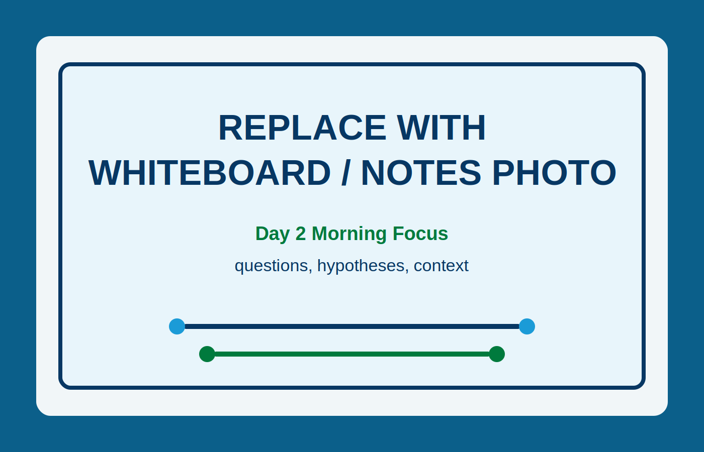

!!! tip "How to use this page during the Summit"
    - This page is your team’s shared workspace and final report-out page. It captures your group’s process and thinking throughout the Summit and will be used to share your work with others. 
    
    - Use this page as your team’s working record during the Summit and your final report-out.
    
    - The Summit has several different goals and thus you will use the page differently each day: Day 1 is for alignment, Day 2 is for building one useful thing, and Day 3 is for synthesis and report- out.
    
    - Look for the green buttons to indicate what you need to edit. 
    
    - Megaphones 📣 indicate which items you will be presenting during the end-of-day report-outs.

    - Only the items with megaphones will be visible when you hit the 'Summit Report Out' button. 

    - If you turn off 'Instructions' then you will only see the page content for public display.
    

# Team 9 Home: Make Me Your Own

!!! note "Day 1 directions"
    Change the title to the name of your project.

    [Edit Day 1 setup in Markdown](https://github.com/CU-ESIIL/Summit_group_2026_9/edit/main/docs/index.md?plain=1#L21){ .md-button target="_blank" rel="noopener" }

!!! tip "For ESIIL staff"
    Group Number: 9
    
    Breakout Room #: (To be assigned by ESIIL Staff)

    [ESIIL staff edit in Markdown](https://github.com/CU-ESIIL/Summit_group_2026_9/edit/main/docs/index.md?plain=1#L28){ .md-button target="_blank" rel="noopener" }
    

!!! note "How to replace the image above"
    Upload an image that represents your project and welcome people to your page. 
    
    Upload your own image to `docs/assets/hero/` and replace the file named `hero.png`. Use a wide image if you can, then refresh the site preview to check how it looks.
    Keep the file path `docs/assets/hero/hero.png` if you want the Markdown above to keep working.

    [Open image folder for changing image](https://github.com/CU-ESIIL/Summit_group_2026_9/tree/main/docs/assets/hero){ .md-button target="_blank" rel="noopener" }

[See a completed example](example.md){ .md-button }

## People { #people .oasis-report-out-context }

!!! note "Day 1 task"
    Get to know your team: share your cards (5-7 mins). Update your team roster (2-3 min).

    Use the in-person name cards to guide quick introductions.

    | Name card prompts | Follow-up notes |
    |---|---|
    |  |  |

    [Edit People in Markdown](https://github.com/CU-ESIIL/Summit_group_2026_9/edit/main/docs/index.md?plain=1#L63){ .md-button target="_blank" rel="noopener" }

| Name | Affiliation | Contact | Github |
|---|---|---|---|
| | | | |
| | | | |

## Team Norms and Decision Making { #team-norms-and-decision-making }

!!! note "Day 1 task"

    Suggested Self-Facilitation Instructions:
    
    - Round Robin: Everyone shares 1 norm that they think will be important for their team during the Summit and perhaps following the Summit (2 min).

    - After everyone has shared, make a list with as many norms as possible in GitHub (5–7 min).

    - Vote on your top 3 ideas. (Each person gets 3 votes; you can use all your votes on 1 idea or spread them out) (2 min).

    - In GitHub, move all team norms with votes to the top of the list.

    | Gradients of agreement | 
    |---|
    |  | 

    [Edit Team Norms in Markdown](https://github.com/CU-ESIIL/Summit_group_2026_9/edit/main/docs/index.md?plain=1#L87){ .md-button target="_blank" rel="noopener" }

Our team norms:

- ...
- ...
- ...

Our decision making strategy:

...

## Our product(s) 📣 { #product-direction .oasis-report-out-section .oasis-report-out-day2 }

!!! note "Day 2 Tasks"
    Morning Focus: questions, hypotheses, context; add at least one visual (photo of whiteboard/notes)

    Afternoon Focus: try a few datasets and analyses. Keep it visual, keep it simple. Update the site to reflect what you test. 

    [Edit content below here in Markdown](https://github.com/CU-ESIIL/Summit_group_2026_9/edit/main/docs/index.md?plain=1#L106){ .md-button target="_blank" rel="noopener" }

Short term:

...

Long term:

- ...
- ...

*Morning whiteboard or notes showing the question, hypotheses, and context we used to start Day 2.*

## Our question(s) 📣 { #project-question .oasis-report-out-section .oasis-report-out-day2 }

Our working question:

...

What would count as progress:

...

## Hypotheses/Intentions [Optional: probably not relevant if you are creating an educational tool]

## Why this matters (the “upshot”) 📣 { #why-this-matters .oasis-report-out-section .oasis-report-out-day2 }

This matters because:

...

People who could use this:

...

## Data sources we’re exploring 📣 { #data-exploration .oasis-report-out-section .oasis-report-out-day2 }

!!! note "data exploration"
    Provide a snapshot showing some initial data patterns. 

    Add 2-4 promising data sources (links +1-line notes)    

*Snapshot showing initial data patterns.*

Promising data sources:

- [Data source 1](#): ...
- [Data source 2](#): ...
- [Data source 3](#): ...
- [Data source 4](#): ...

## Methods/technologies we’re testing 📣 { #methods-and-code .oasis-report-out-section .oasis-report-out-day2 }

!!! note "methods"
    Add 2-4 methods/technologies we're testing (stats, models, viz).

[View shared code](https://github.com/CU-ESIIL/Summit_group_2026_9/tree/main/code){ .md-button }

Methods/technologies we are testing:

| Method or technology | What we tested | Early note |
|---|---|---|
| ... | ... | ... |
| ... | ... | ... |
| ... | ... | ... |
| ... | ... | ... |

### Challenges identified

- ...
- ...

### Visuals

### Next Steps

Short term: 

Long term: 

!!! note "Day 3 Tasks"
    Sythesis: highlight 2-3 visuals that tell the story; keep text crisp. Practice a 6-minute walkthrough of the homepage. Why -> Questions -> Data/Methods -> Findings -> Next 

    [Edit content below here in Markdown](https://github.com/CU-ESIIL/Summit_group_2026_9/edit/main/docs/index.md?plain=1#L203){ .md-button target="_blank" rel="noopener" }

## Team Photo { #team-photo }

*Team members and collaborators who contributed to this project.*

## Findings at a glance 📣 { #findings-at-a-glance .oasis-report-out-section .oasis-report-out-day3 }

Headline 1 — what, where, how much

...

Headline 2 — change/trend/contrast

...

Headline 3 — implication for practice or policy

...

## Visuals that tell a story 📣 { #story-visuals .oasis-report-out-section .oasis-report-out-day3 }

*Visual 1: the main pattern or output we want people to remember.*

## What’s next? 📣 { #whats-next .oasis-report-out-section .oasis-report-out-day3 }

Short term:

- ...

Long term:

- ...

Who should see this next

- ...

## Cite & Reuse { #cite-reuse }

If you use these materials, please cite:

Summit Team. (2026). *Summit Group 2026 Team 9 — Innovation Summit 2026*. https://github.com/CU-ESIIL/Summit_group_2026_9

License: CC-BY-4.0 unless noted. 
