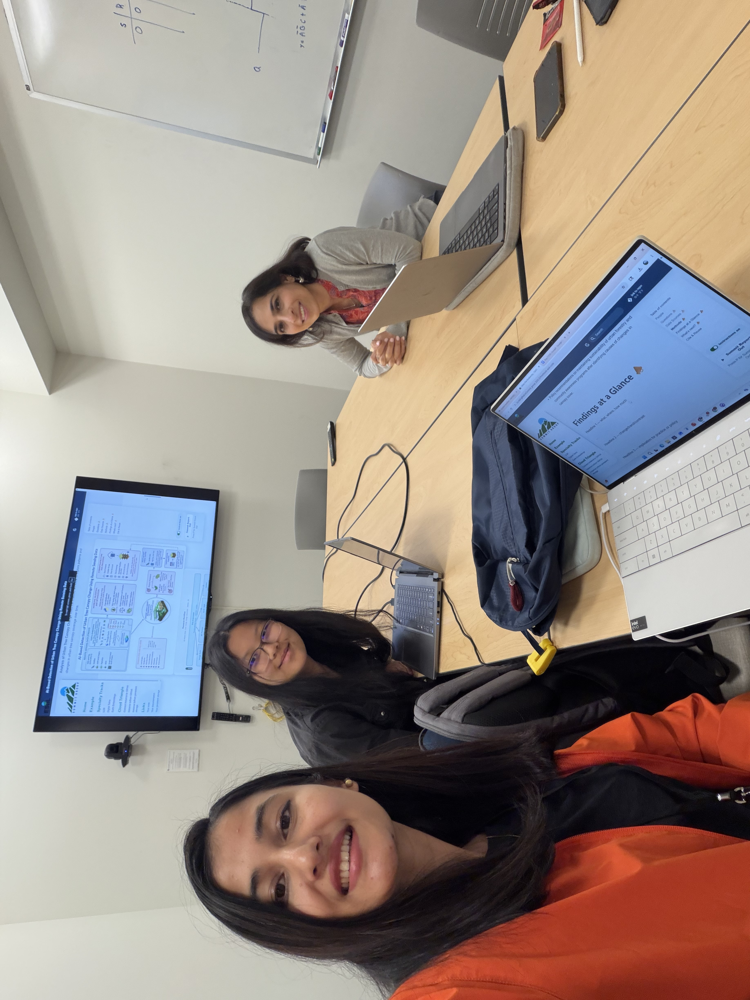
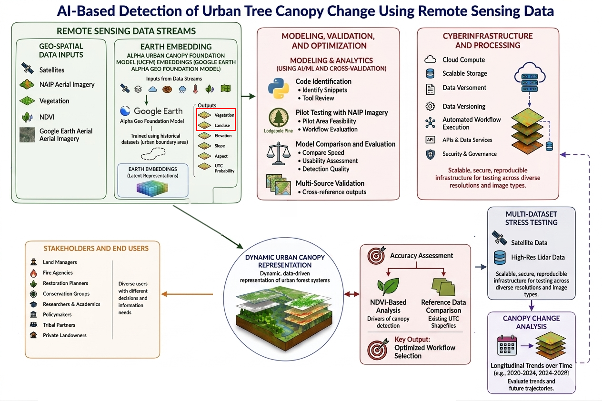
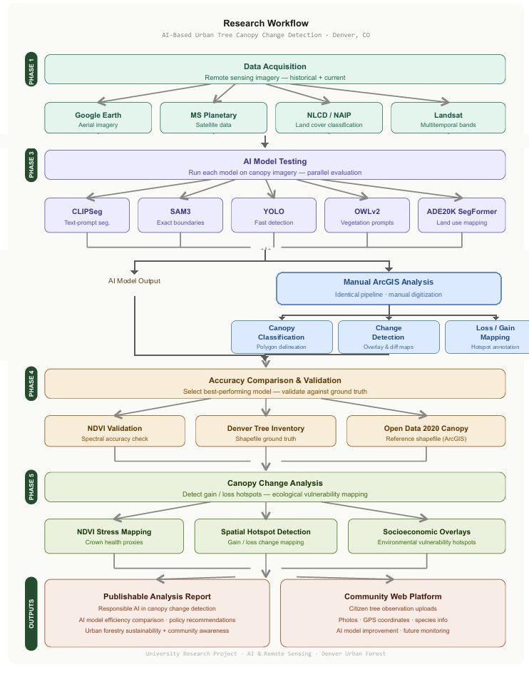
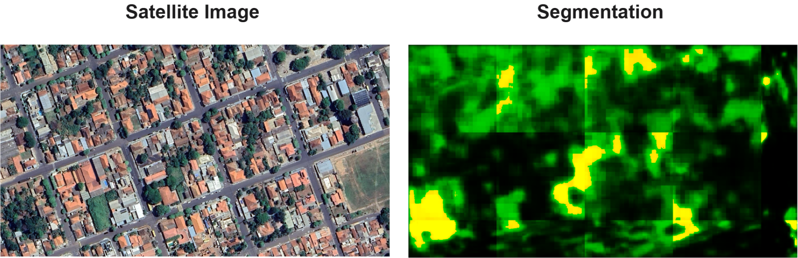

# AI-Based Detection of Urban Tree Canopy Change Using Remote Sensing Data

## People { #people .oasis-report-out-context }

| Name | Affiliation | Contact | Github |
|---|---|---|---|
| Aakriti Joshi | Clemson University | aakritj@g.clemson.edu |  |
| Sara Tabatabaie | ENVD, University of Colorado, Boulder | Sara.Tabatabaie@colorado.edu |  |
| Olivia Zhang | University of Florida | oliviazhang@ufl.edu | via-zhang |

## Questions { #product-direction .oasis-report-out-section .oasis-report-out-day2 }

Goal: To assess the efficiency of AI models in detecting urban tree canopy cover change over time.

<b>Main Working Questions:</b>

- How effectively can AI models detect and analyze urban tree canopy change over time using remote sensing data?

- What is the most effective workflow for using AI and remote sensing data to detect changes in urban tree canopy coverage over time?

<b>Sub-Questions:</b>

1. Which AI or machine learning model provides the highest accuracy in detecting urban tree canopy change over time?

2. How can remote sensing imagery and urban tree inventory data be integrated to improve canopy change detection?

3. What spatial or environmental factors may contribute to observed changes in urban tree canopy cover? (the longer-term objective)

4. How can AI-assisted urban canopy monitoring support community-based urban forestry efforts?

## Data Sources { #data-exploration .oasis-report-out-section .oasis-report-out-day2 }

<b>Input data for comparison of efficiency of AI models in tree canopy detection:</b>

- Google Earth Aerial Imagery

- Microsoft Planetary Aerial Imagery

- National Land Cover Database (NLCD)

- Landsat Satellite Imagery

- National Aerial Imagery Program (NAIP) Aerial Imagery

<b>For validation/verification of AI detection of canopy after efficiency analysis, we can use the following data sources:</b>

- Tree Inventory Data

- GIS Tree/Vegetation Shapefiles for different municipalities

- iNaturalist Data

- Normalized Difference Vegetation Index (NDVI) from satellites

<b>AI Models:</b>

- Clip Segmentation - connects images with text, works with text prompts; not always the most precise for detailed canopy boundaries

- Segment Anything Model (SAM3) - separate any object from an image - outline exact canopy shape - can provide accurate boundaries, canopy area calculations, change comparison over time
https://ai.meta.com/research/sam3/

- YOLO (You Only Look Once) - finds objects in images, faster than other models in object detection, but might not have high precision for canopy boundaries
https://www.ultralytics.com/?utm_source=chatgpt.com

- OWLv2 for vegetation: uses text prompts to identify and localize objects, including vegetation, in imagery 
https://huggingface.co/google/owlv2-base-patch16
https://github.com/inuwamobarak/OWLv2

- ADE20K SegFormer - classifies objects in images; best known for land use mapping
https://github.com/CSAILVision/ADE20K

## Methods { #methods-and-code .oasis-report-out-section .oasis-report-out-day2 }

<b>Tool and Code Identification</b>
    Identified and reviewed Python code snippets and AI-based image detection tools suitable for detecting urban tree canopy coverage using remote sensing imagery.

<b>Pilot Testing with NAIP Imagery</b>
    Applied multiple AI image detection models to a small pilot study area using NAIP aerial imagery to evaluate workflow feasibility and processing performance.

<b>Model Comparison and Evaluation</b>
    Compared the performance of different AI detection tools based on processing speed, usability, and detection quality.

<b>Accuracy Assessment</b>
    Using ArcGIS to evaluate detection accuracy by comparing AI-generated canopy outputs with:
    - NDVI-based vegetation analysis
    - Existing urban tree canopy shapefiles and reference datasets

<b>Workflow Optimization</b>
    Selected the most effective AI detection workflow based on overall performance and accuracy.

<b>Multi-Dataset Testing</b>
    Applied the optimized workflow to additional datasets, including: 
    - alternative satellite imagery sources
    - Google Earth aerial imagery to test adaptability and consistency across different image types and resolutions.

<b>Analysis of Urban Tree Canopy Change</b>
    Used the finalized workflow to explore patterns and changes in urban tree canopy coverage over time.

### Next Steps

Future prospects of this project: Moving from a mapping study to an ecological diagnosis study

- Using AI-detected canopy dynamics to identify functional vulnerability hotspots in Denver's urban forest. This can be done by combining change detection with crown health proxies (NDVI stress, not just presence). 

- Socioeconomic and Environmental changes overlays to show where the urban forest is most ecologically at risk and why.

- Policy recommendations on maintaining sustainability of urban forestry and community awareness programs after identifying causes of changes in canopy cover. 

## Preliminary Results { #findings-at-a-glance .oasis-report-out-section .oasis-report-out-day3 }

Below shows an example segmentation produced by the CLIPSegmentation on a satellite image using the GeoAI Python package.

## Cite & Reuse { #cite-reuse }

If you use these materials, please cite:

Summit Team. (2026). *Summit Group 2026 Team 9 — Innovation Summit 2026*. https://github.com/CU-ESIIL/Summit_group_2026_9

License: CC-BY-4.0.
